## What is Array in Javascript?
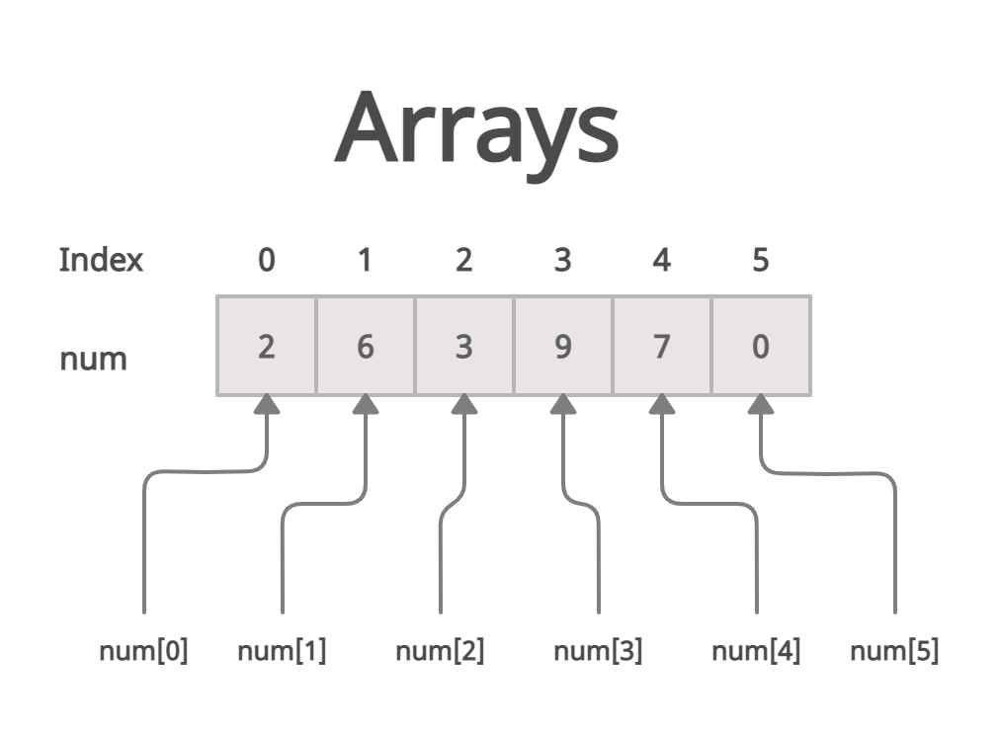
### ArrayОбъект, как и массивы в других языках программирования, позволяет хранить коллекцию из нескольких элементов под одним именем переменной и имеет элементы для выполнения обычных операций с массивами.

## Method Array
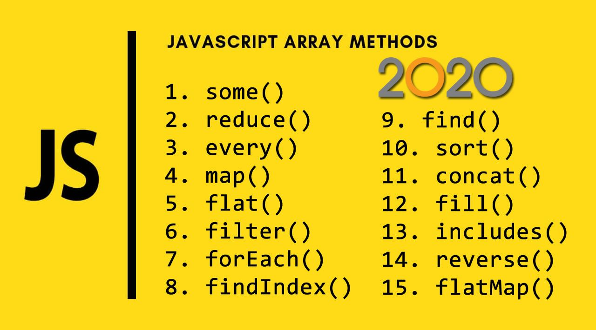

## Method push()
### push()Метод Array экземпляров добавляет указанные элементы в конец массива и возвращает новую длину массива.
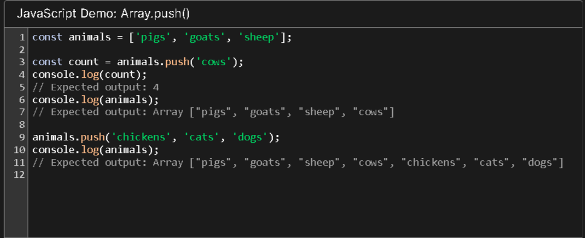

## Method pop()
### pop()Метод Array экземпляров удаляет последний элемент из массива и возвращает этот элемент. Этот метод изменяет длину массива.
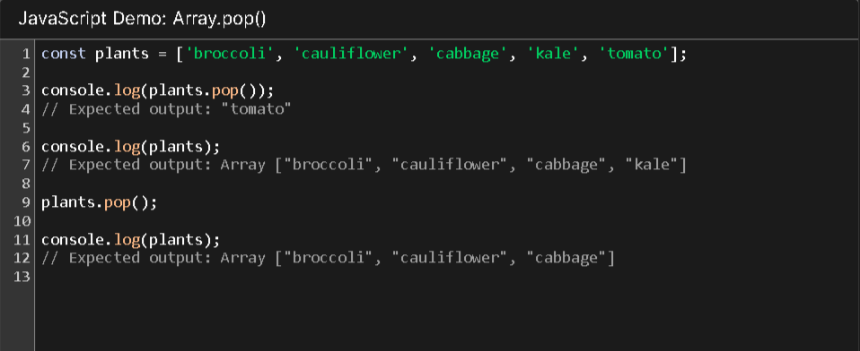

## Method unshift()
### unshift()Метод Array экземпляров добавляет указанные элементы в начало массива и возвращает новую длину массива.
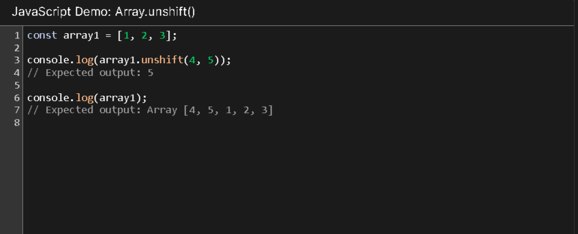

## Method shift()
### shift()Метод Array экземпляров удаляет первый элемент из массива и возвращает этот удаленный элемент. Этот метод изменяет длину массива.
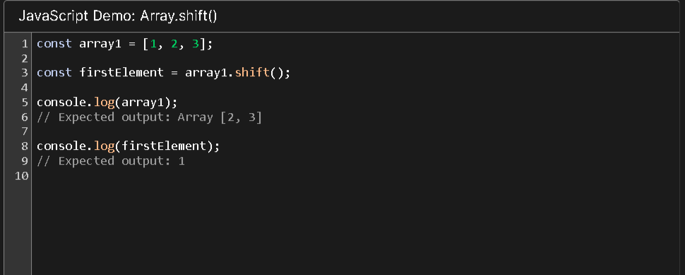

## Method tostring()
### toString()Метод Array экземпляров возвращает строку, представляющую указанный массив и его элементы.
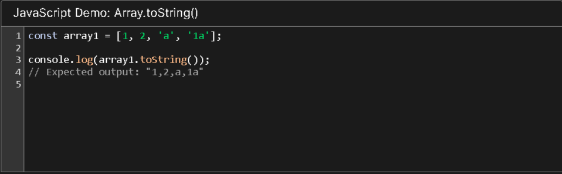

## Method indexOf()
### indexOf()Метод Array экземпляров возвращает первый индекс, по которому данный элемент может быть найден в массиве, или -1, если он отсутствует.
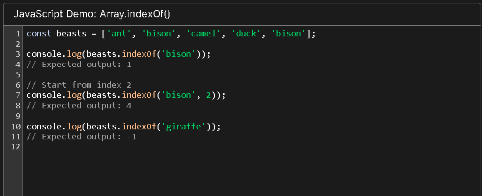

## Method includes()
### includes()Метод Array экземпляров определяет, включает ли массив определенное значение среди своих записей, возвращая true или false соответствующим образом.
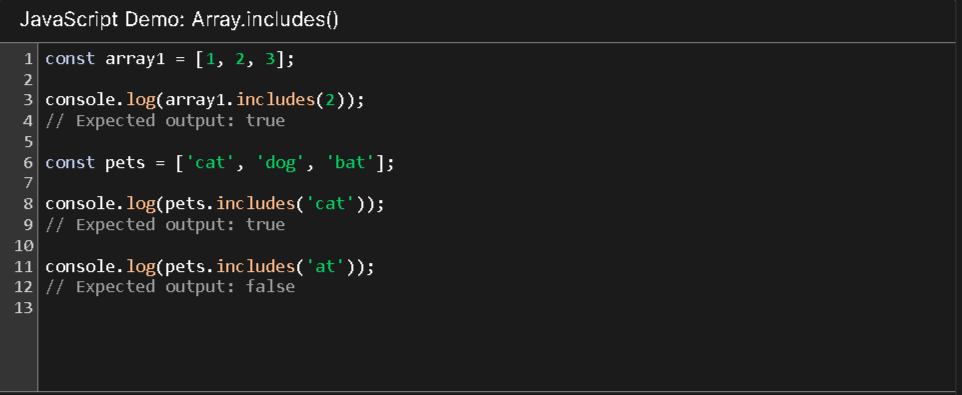

## Method slice()
### slice()Метод Array экземпляров возвращает мелкую копию части массива в новый объект массива, выбранный из start по end (end не включен), где start и end представляют индекс элементов в этом массиве. Исходный массив изменен не будет.
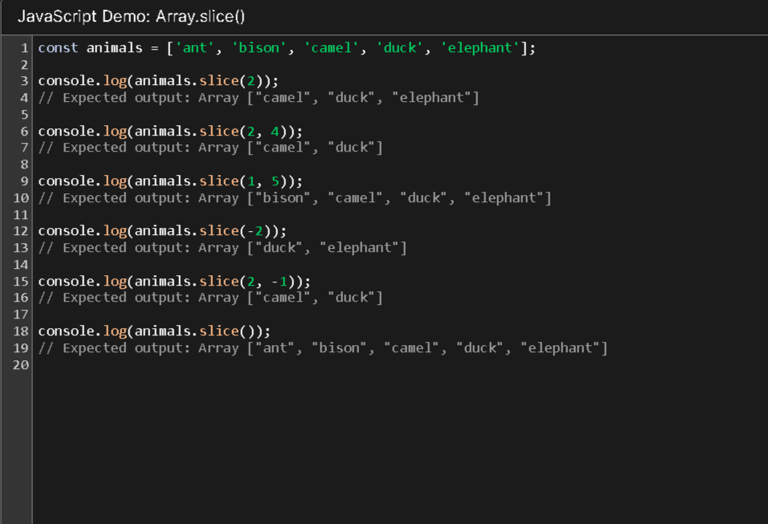

## Method concat()
### concat()Метод Array экземпляров используется для объединения двух или более массивов. Этот метод не изменяет существующие массивы, а вместо этого возвращает новый массив.
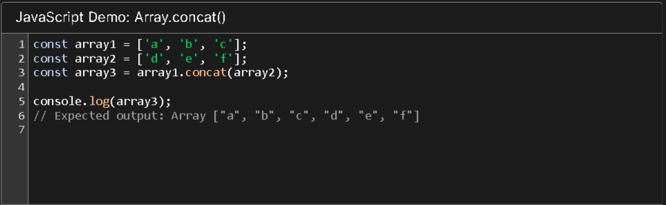

## Method splice()
### splice()Метод Array экземпляров изменяет содержимое массива путем удаления или замены существующих элементов и /или добавления новых элементов на место.
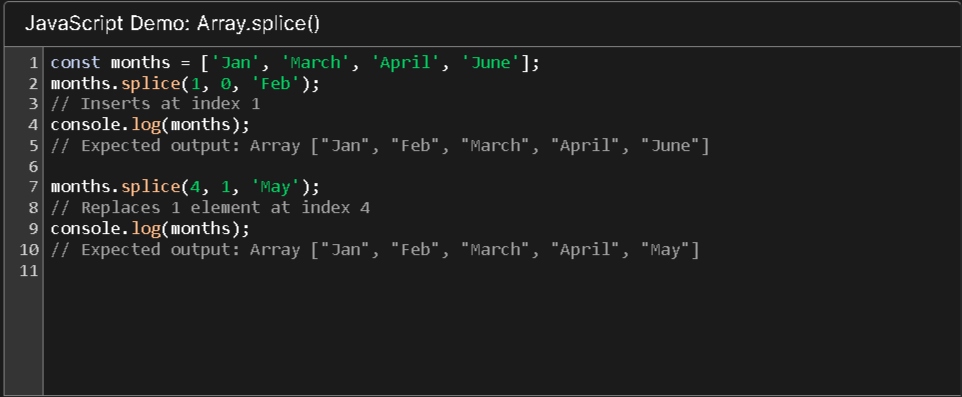

## Method callback
### Kоллбэк — это функция, которая должна быть выполнена после того, как другая функция завершила выполнение (отсюда и название: callback — функция обратного вызова).
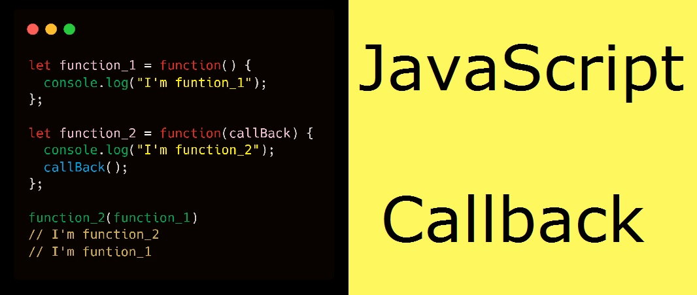

## Method map()
### map()Метод Array экземпляров создает новый массив, заполненный результатами вызова предоставленной функции для каждого элемента в вызывающем массиве.
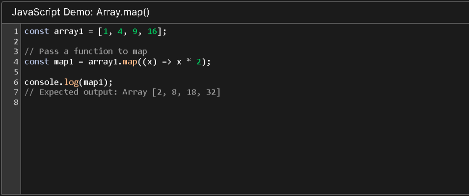

## Method forEach()
### forEach()Метод Array экземпляров выполняет предоставленную функцию один раз для каждого элемента массива.
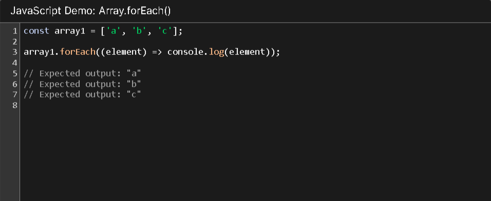

## Method find()
### find()Метод Array экземпляров возвращает первый элемент в предоставленном массиве, который удовлетворяет предоставленной функции тестирования. Если никакие значения не удовлетворяют функции тестирования, undefined возвращается.
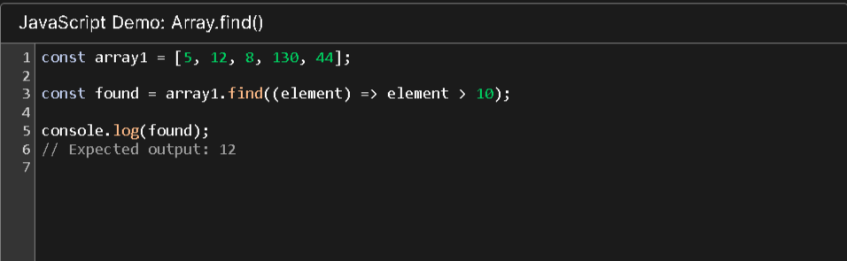

